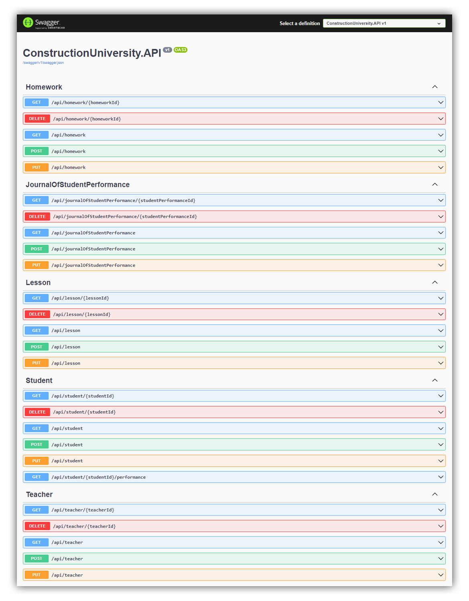

# ASP.NET Core Web API - Backend for University

## Стек
- ASP.NET Core 6.0
- Entity Framework Core
- MS SQL Server
- Automapper
- FluentValidation

## Архитектура
- Hexagonal architecture

## Превью

